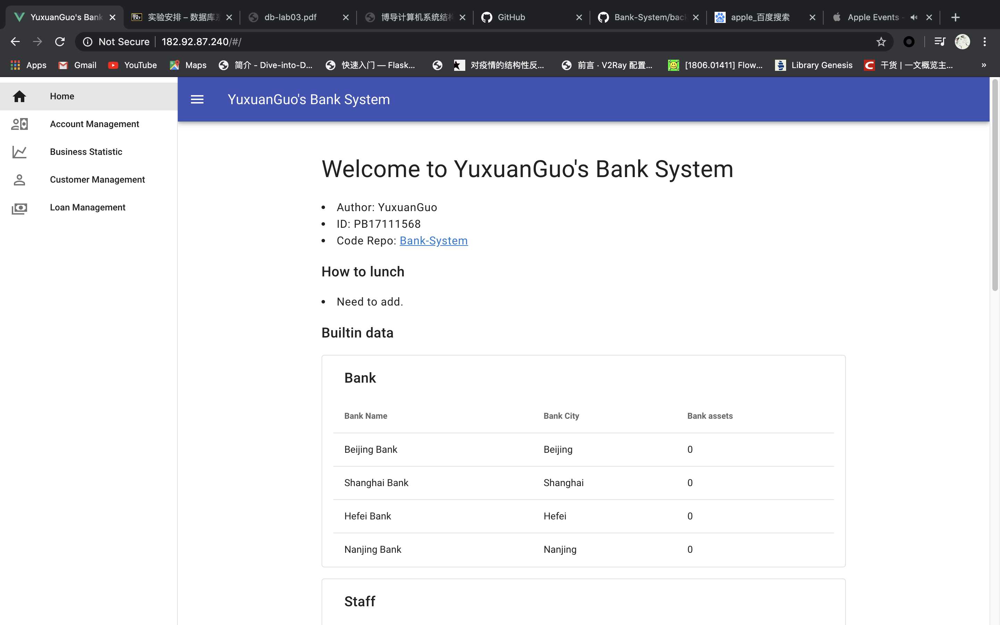

[TOC]

# 银行业务管理系统 系统设计与实验报告

- 姓名：郭雨轩
- 学号：PB17111568
- 项目部署地址：[Bank Management System](http://182.92.87.240/)
- 项目源代码仓库：[Bank-System.git](https://github.com/SkilfulBugsMaker/Bank-System)

## 概述

### 系统目标

本实验采用网页APP的形式，目的是为了构建一个银行管理系统，完成对顾客信息、账户信息和贷款信息的增删改查，同时后台数据库还需维护和保持这三类数据之间的一些约束。

### 需求说明

- **数据库**：银行有多个支行。各个支行位于某个城市，每个支行有唯一的名字。银行要监控每个支行的 资产。 银行的客户通过其身份证号来标识。银行存储每个客户的姓名、联系电话以及家庭 住址。为了安全起见，银行还要求客户提供一位联系人的信息，包括联系人姓名、手机号、 Email 以及与客户的关系。客户可以有帐户，并且可以贷款。客户可能和某个银行员工发生 联系，该员工是此客户的贷款负责人或银行帐户负责人。银行员工也通过身份证号来标识。 员工分为部门经理和普通员工，每个部门经理都负责领导其所在部门的员工，并且每个员工 只允许在一个部门内工作。每个支行的管理机构存储每个员工的姓名、电话号码、家庭地 址、所在的部门号、部门名称、部门类型及部门经理的身份证号。银行还需知道每个员工开 始工作的日期，由此日期可以推知员工的雇佣期。银行提供两类帐户——储蓄帐户和支票帐 户。帐户可以由多个客户所共有，一个客户也可开设多个账户，但在一个支行内最多只能开 设一个储蓄账户和一个支票账户。每个帐户被赋以唯一的帐户号。银行记录每个帐户的余 额、开户日期、开户的支行名以及每个帐户所有者访问该帐户的最近日期。另外，每个储蓄 帐户有利率和货币类型，且每个支票帐户有透支额。每笔贷款由某个分支机构发放，能被一 个或多个客户所共有。每笔贷款用唯一的贷款号标识。银行需要知道每笔贷款所贷金额以及 逐次支付的情况（银行将贷款分几次付给客户）。虽然贷款号不能唯一标识银行所有为贷款 所付的款项，但可以唯一标识为某贷款所付的款项。对每次的付款需要记录日期和金额。
- **功能**：
  - 客户管理：提供客户所有信息的增、删、改、查功能；如果客户存在着关联账户或者贷 款记录，则不允许删除
  - 账户管理：提供账户开户、销户、修改、查询功能，包括储蓄账户和支票账户；账户号不允许修改
  - 贷款管理：提供贷款信息的增、删、查功能，提供贷款发放功能；贷款信息一旦添加成 功后不允许修改；要求能查询每笔贷款的当前状态（未开始发放、发放中、已全部发 放）；处于发放中状态的贷款记录不允许删除；
  - 业务统计：按业务分类（储蓄、贷款）和时间（月、季、年）统计各个支行的业务总金 额和用户数，要求对统计结果同时提供表格和曲线图两种可视化展示方式。

### 本报告的主要贡献

本报告主要有以下贡献：

- 对发布的需求进行了进一步的分析与与扩充，对所需要实现的功能进行拆分和合并。
- 介绍满足给出需求的一个前后端网页应用的设计思路和实现细节
- 对上述实现的系统进行了较为完备的测试

## 总体设计

### 系统模块结构

本系统是一个前后端分离的网页APP，主要的逻辑模块分为前端部分和后端部分。下面分别进行阐述：

- **前端**：主要分为5个模块，对应网页应用的5个界面，分别是欢迎界面、客户管理界面、账户管理界面、贷款管理界面和业务统计界面，每个界面分别对应需求中一大类功能，并提供了一些按钮和输入框来与用户交互。
- **后端**：主要分为两个模块，数据库模块和接口（API）模块，数据库模块中定义了Mysql数据库中各个table中的字段的类型以及table之间的外键关系；接口模块负责接收、处理并回复来自前端的信息。

### 系统工作流程

当用户进入到银行系统的页面后，可以在四种主要的功能中进行选择和切换。当输入了满足要求的数据并点击`COMMIT`按钮后，前端向后端服务器`post`用户填入的所有数据，服务器在解析用户的信息后，按照对应的操作检查参数是否合法，若合法则执行对应的操作并返回执行后的状态信息到前端服务器，前端服务器将接收到的消息渲染在页面上，从而完成一次与服务器的交互。

### 数据库设计

本实验数据库的设计完全照搬本人的lab2，在此不再赘述，仅放一张截图：


需要额外说明的是，为了避免循环依赖，我把所有的外键属性均设置为可以为空，通过限定操作数据库的代码保证部分不能为空的外键列满足需求。

## 详细设计

### 写在前头

上述给出的所有需求存在一些不明确的部分，也有一部分额外的必要的约条件未给出，在此进行一些有益的补充：

- 不区分`开户`概念和`拥有账户所有权`概念
- 按照正常人的逻辑，`账户`实体的`开户银行`、`开户日期`、`账户类型`不能直接修改，仅可以通过删除再新建的形式修改
- 为了使UI逻辑清晰，将`开户`和`创建贷款`这两类的行为分解为创建`账户`或者`贷款`，再添加`账户所有人`或着`贷款所有人`这两个行为序列，这可能会导致存在无人所有的账户。
- 删除`账户`或者`贷款`的时候，会自动将`账户`或者`贷款`关联的`顾客`一并删除
- 支持批量操作，例如：把所有`联系人电话`为`123`的`顾客`的`贷款负责人`改为`staff_2`
- 更改`顾客`的`身份证号`的同时会更改相应的`借贷信息`和`账户所有`信息
- 不允许删除有`借贷关系`和`账户所有`的顾客
- 统计界面，储蓄业务的统计为在规定时间段内所开户的所有储蓄账户的余额总数，贷款业务的统计为在规定时间段内所有贷款支付的金额总和。
- 当输入的贷款支付的金额大于贷款剩余未支付的额度时，会自动裁剪支付额度

另外，由于本实验涉及到的代码量较大，不可能逐行进行解释，以下会先介绍模块使用的工具链，并使用伪代码的方式进行介绍

### 后端

#### 工具链及文件组织

我是用`Flask`作为后端框架，基于`flask_restful`提供`RESTful`的API，基于`flask_sqlalchemy`这个orm框架对数据库操作，对于一个小的Web App来说，使用`Flask`框架有助于加快开发的速度，但是因为该框架并无一个规范的项目文件组织形式，在这里我采用以下形式：

```shell
backend
├── app
│   ├── __init__.py	# 将app文件夹变成一个python module
│   ├── app.py 			# 定义flask的app对象
│   ├── models.py		# 定义数据库的所有table
│   └── views.py		# 定义所有接口
└── run.py 					# 管理整个后端

```

#### app/models.py

在这个文件中我实现了对所有数据库table的定义，以这段代码为例：

``` python
class CheckingAccountRecord(db.Model):
    # start attributes
    car_last_visit_time = db.Column(db.Date, nullable=True)
    # end attributes

    # start foreign keys
    car_c_identity_code = db.Column(
        db.String(IDENTITY_CODE_LEN),
        db.ForeignKey('customer.c_identity_code'),
        primary_key=True
    )
    car_sb_name = db.Column(
        db.String(NAME_LEN),
        db.ForeignKey('sub_bank.sb_name'),
        primary_key=True
    )
    car_a_code = db.Column(
        db.String(CODE_LEN),
        db.ForeignKey('account.a_code'),
        nullable=True
    )
```

定义了名为`checking_account_record`的tabel和4列对应的信息，其余的数据库定义不再赘述，可以参照[models.py](https://github.com/SkilfulBugsMaker/Bank-System/blob/master/backend/app/models.py)

#### app/views.py

在这个文件中我实现了所有的接口定义，本实验中共有4个后端接口，分别为`/api/business-statistic`、`/api/customer-management`、`/api/account-management`、`/api/loan-management`。同样的，我使用伪代码的方式介绍`/api/customer-management`。

``` python
class CustomerManagement(Resource):
  	# 使用flask内置的parser定义post的参数
    parser = reqparse.RequestParser()
    parser.add_argument(
   			'xxx', ...
    )
    # 定义post时的行为
    def post(self):
      	# 解析参数
        args = self.parser.parse_args()
       	
        # 若是增加记录
            # 检查贷款负责人是否存在，不存在则返回对应错误信息
          	
            # 检查账户负责人是否存在，不存在则返回对应错误信息

            # 检查用户id是否存在，若存在则返回对应错误信息

            # 插入记录，返回插入成功的信

        # 若是删除记录：
            # 查找所有满足要求的客户id
            
            # 若没找到符合要求的客户，返回对应错误信息
            
            # 若要删除的客户关联了贷款或账户，不允许删除，返回对应错误信息
            
            # 删除账户，返回删除了几个账户
            

       	# 若是更改记录：
        		# 查找所有满足要求的客户id
          
          	# 若没找到符合要求的客户，返回对应错误信息
            
            # 若要更改账户负责人或者贷款负责人，检查是否存在，若不存在则返回错误信息
            
						# 若不修改顾客的id
            		# 直接修改，并返回修改成功的消息
            
            # 否则
            		# 若满足修改条件的顾客有多个，不允许修改，返回错误信息
              	# 若要修改的顾客id已经存在，不允许修改，返回错误信息
                # 修改顾客id和所有相关的账户信息和贷款信息，返回成功消息
                
				# 若是查找记录
        		
        else:
            # 查找所有满足要求的客户id
            
            # 若没找到符合要求的客户，返回对应错误信息
            
            # 返回查找到的结果
            
				# 返回查找到的结果
        return result
```

如果想要了解更多的后端处理逻辑，可以查看[views.py](https://github.com/SkilfulBugsMaker/Bank-System/blob/master/backend/app/views.py)

#### run.py

该文件管理整个后端app，可以通过调用`init_db()`函数插入一些预定义的数据，或者实后端应用的部署

### 前端

#### 工具链及文件组织

前端使用`Vue.js`开发，为了保证用户的交互体验和内容呈现的美观性，使用了UI框架`Vuetify`，文件的组织如下：

``` shell
frontend/src
├── App.vue											# 应用主组件
├── components									# 一些子组件
│   ├── AccountManage.vue				# 账户管理界面
│   ├── BusinessStatistic.vue		# 数据统计界面
│   ├── CustomerManage.vue			# 客户界面
│   ├── LoanManage.vue					# 贷款管理界面
│   ├── PageNotFound.vue				# 404界面
│   └── Welcome.vue							# 欢迎界面
├── main.js											# 主js文件，注册一些用到的模块
└── router.js										# 定义路由规则

```

完成开发后，可以使用`npm run build`生成js和html文件

#### 网页

同样的，为了保持报告的简洁性，在此仅选择介绍一个组件，使用伪代码的形式：

``` vue
<template>
  <v-container>
    <v-card outlined class="my-4 px-4">
      <v-card-title>Please Input Information</v-card-title>
      定义了一些输入框和按钮
    </v-card>
    <v-divider class="py-2"></v-divider>
    <v-card flat v-if="graphType == 'Table' && receiveData != ''">
      <v-card-title v-if="receiveData != ''">
       {{ receiveData.business_type }} {{ receiveData.start_time }} to {{ receiveData.end_time }}
      </v-card-title>
      使用列表方式展示得到的数据
    </v-card>
    
    <v-card flat v-if="graphType == 'Chart' && receiveData != ''">
      <v-card-title>
       {{ receiveData.business_type }} {{ receiveData.start_time }} to {{ receiveData.end_time }}
      </v-card-title>
      使用图的方式展示得到的数据
    </v-card>
  </v-container>
</template>

<script>
export default {
  name: "BusinessStatistic",
  data: () => ({
    // 定义基础的数据
  }),
  computed: {
    // 定义计算得到的数据
  },
  methods: {
    commitForm: function() {
      // 使用axios向后端服务器post数据
      this.$axios
        .post("/business-statistic", this.postData)
        .then((response) => {
          this.receiveData = response.data
        })
        .catch(function(error) {
          alert(error)
        });
    },
    resetForm: function() {
      // 若是reset form，清空所有的输入框
      for (let item in this.inputData) {
        this.inputData[item] = "";
      }
    }
  }
};
</script>

```

如果想要了解更多的前端代码，可以查看[src](https://github.com/SkilfulBugsMaker/Bank-System/blob/master/frontend/src)

## 实现与测试

### 实现结果

本实验已经部署到一台阿里云服务器上并可以直接访问，下面截取一些界面：

欢迎界面，同时显示所有的内置数据：



账户管理界面：


统计界面：


客户管理界面：


贷款界面：


### 测试结果

受限于篇幅限制，本文不可能对所有的输入情况进行展示，这里仅展示部分：

尝试输入不合法的贷款金额：


尝试删除关联账户或者贷款的客户：


查看一个贷款的状态：


更改客户主键：


更多的测试可以通过访问项目的部署网站自行尝试。

## 总结与讨论

本实验实现了一个前后端分离的银行管理系统，并完成了所有需求。我在进行实验的过程中熟练掌握了`SQLAlchemy`的用法，掌握了主流前端框架`Vue.js`和后端框架`Flask`的使用，对跨域请求和反向代理等知识也有了深入的了解，对开发前后端分离应用也积累了宝贵的经验，收获非常大。

**同时，我也非常高兴的完成了本科阶段的最后一门课程实验，毕业（伪）快乐！**